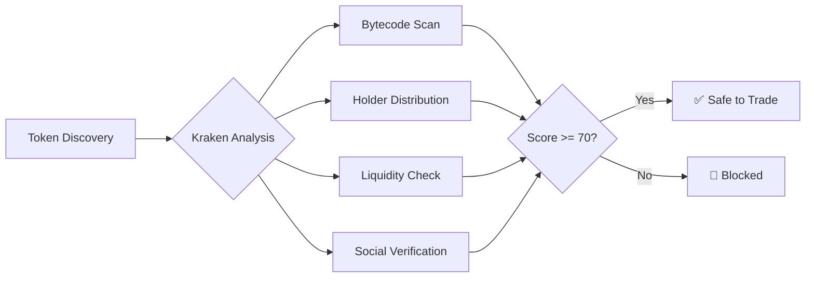
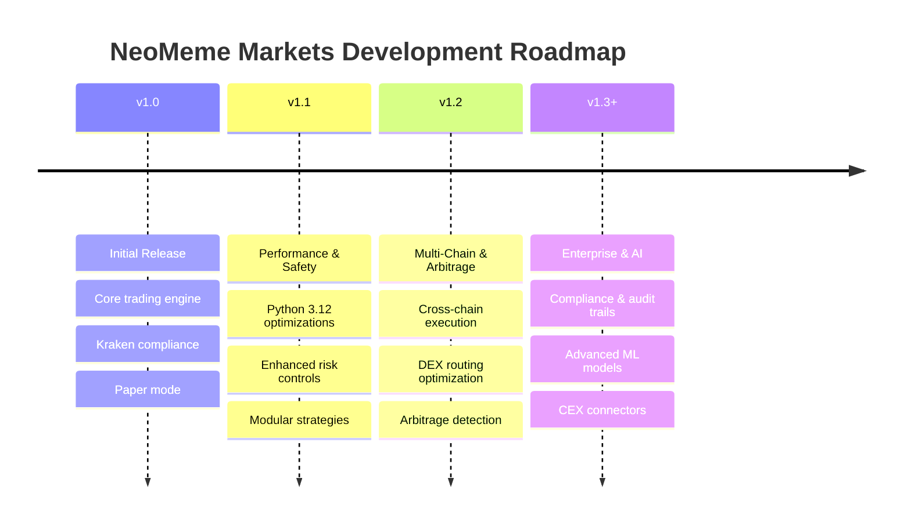

<div align="center">

# 🚀 NeoMeme Markets

### Autonomous Hardened Meme-Coin Trading Bot


[](https://github.com/Snapwave333/membot/releases/latest)
[](https://github.com/Snapwave333/membot/releases)
[](LICENSE)
[](https://github.com/Snapwave333/membot/stargazers)
[](https://python.org)

<br/>

**🔐 Fail-Closed Security** • **🧠 AI-Powered Decisions** • **⚡ Multi-Chain Support** • **📊 Real-Time Compliance**

<br/>

[](https://github.com/Snapwave333/membot/releases/latest/download/NeoMemeMarkets-Setup.exe)
&nbsp;&nbsp;
[](USER_MANUAL.md)
&nbsp;&nbsp;
[](IDIOTS_GUIDE.md)

</div>

---

<div align="center">

## 💡 Why NeoMeme Markets?

</div>

<table>
<tr>
<td width="33%" align="center">

### 🛡️ Security First

**Fail-closed architecture** that refuses to trade when uncertain. Your funds stay safe with encrypted wallets, kill-switches, and comprehensive audit trails.

</td>
<td width="33%" align="center">

### 🧠 Smart Trading

**Layered intelligence** combining rule-based logic with ML predictions. Kraken compliance scoring ensures you only trade safe tokens.

</td>
<td width="33%" align="center">

### ⚡ Multi-Chain

**Solana + EVM support** with real-time market monitoring, DEX integration, and optimized transaction execution.

</td>
</tr>
</table>

---

<div align="center">

## 🎮 Bot Personalities


&nbsp;&nbsp;&nbsp;&nbsp;

&nbsp;&nbsp;&nbsp;&nbsp;


*Happy* • *Neutral* • *Alert*

Your bot adapts its personality based on market conditions and portfolio health!

</div>

---

## 📋 Table of Contents

<details open>
<summary><strong>Click to expand</strong></summary>

- [Quick Start](#-quick-start)
- [Features](#-features)
  - [Security & Safety](#-security--safety)
  - [Kraken Compliance](#-kraken-compliance-layer)
  - [Intelligent Trading](#-intelligent-trading)
  - [Multi-Chain Support](#-multi-chain-support)
  - [Signal Processing](#-signal-processing)
- [Architecture](#-architecture)
- [Installation](#-installation)
- [Configuration](#-configuration)
- [Usage](#-usage)
- [Desktop App](#-desktop-app-windows)
- [Tech Stack](#-tech-stack)
- [Performance](#-performance)
- [Roadmap](#-roadmap)
- [FAQ](#-faq)
- [Contributing](#-contributing)
- [License](#-license)

</details>

---

## ⚡ Quick Start

```bash
# 1. Clone the repository
git clone https://github.com/Snapwave333/membot.git
cd membot

# 2. Create virtual environment
python -m venv venv
source venv/bin/activate  # Windows: venv\Scripts\activate

# 3. Install dependencies
pip install -r requirements.txt

# 4. Configure environment
cp env.example .env
# Edit .env with your settings

# 5. Run in Paper Mode (safe testing)
python main.py --paper-mode
```

<div align="center">

### 🎯 First Time? Start Here!

[](IDIOTS_GUIDE.md)

*No crypto experience needed. We'll walk you through everything.*

</div>

---

## ✨ Features

### 🔒 Security & Safety

<table>
<tr>
<td width="50%">

**Fail-Closed Architecture**
- Refuses to trade when in doubt
- Encrypted hot wallets (Argon2 KDF + AES-GCM)
- Isolated paper mode for testing
- Comprehensive audit logging

</td>
<td width="50%">

**Safety Controls**
- 🚨 **Kill Switch** - Instant emergency stop
- 💰 **Profit Sweep** - Auto-secure gains
- 📊 **Position Limits** - Prevent overexposure
- ⛔ **Daily Loss Caps** - Protect your capital

</td>
</tr>
</table>

### 🦑 Kraken Compliance Layer

<div align="center">


```mermaid
graph LR
    A[Token Discovery] --> B{Kraken Analysis}
    B --> C[Bytecode Scan]
    B --> D[Holder Distribution]
    B --> E[Liquidity Check]
    B --> F[Social Verification]
    C --> G{Score >= 70?}
    D --> G
    E --> G
    F --> G
    G -->|Yes| H[✅ Safe to Trade]
    G -->|No| I[🚫 Blocked]
```

</div>

- **Token Safety Assessment** - Bytecode analysis, owner privilege detection
- **Liquidity Verification** - LP lock status, router compatibility
- **Holder Analysis** - Top holder concentration, whale detection
- **Social Signals** - Multi-source corroboration, DexScreener/Birdeye validation
- **Hard Veto System** - Automatic blocking of unsafe tokens (score < 60)

### 🧠 Intelligent Trading

<table>
<tr>
<td width="50%">

**Layered Brain Architecture**

```
┌─────────────────┐
│   ML Engine     │ (40% weight)
│  • Price Pred   │
│  • Volume Pred  │
│  • Sentiment    │
└────────┬────────┘
         │
         ▼
┌─────────────────┐
│  Rules Engine   │ (60% weight)
│  • Entry Rules  │
│  • Exit Rules   │
│  • Risk Rules   │
└────────┬────────┘
         │
         ▼
┌─────────────────┐
│ Trading Signal  │
│ Confidence ≥ 0.6│
└─────────────────┘
```

</td>
<td width="50%">

**ML Models**
- 📈 **Price Prediction** - XGBoost, LightGBM
- 📊 **Volume Forecasting** - Trend analysis
- 💭 **Sentiment Analysis** - Market mood
- ⚠️ **Risk Assessment** - Position scoring
- 🎯 **Confidence Calibration** - Kraken-weighted

**Risk Management**
- Position sizing: 2% of portfolio
- Stop-loss: 8% below entry
- Take-profit: 15% above entry
- Max concurrent positions: 5
- Daily loss limit: 5%

</td>
</tr>
</table>

### ⛓️ Multi-Chain Support

<div align="center">

| Chain | Features | DEX Integration |
|-------|----------|-----------------|
| **Solana** | SPL tokens, compute budget optimization | Jupiter, Raydium, Orca, Serum |
| **Ethereum** | ERC-20 tokens, gas optimization | Uniswap, SushiSwap, 1inch |

</div>

**Key Capabilities:**
- 🔄 Real-time RPC with automatic failover
- 📡 Health monitoring and rate limiting
- 💸 Transaction priority and fee management
- 🌐 Simultaneous multi-chain operations

### 📡 Signal Processing

- **Telegram Integration** - Real-time signal ingestion via Bot API
- **Astroturf Detection** - Identifies bot accounts, fake engagement, spam
- **Multi-Source Validation** - Cross-platform signal corroboration
- **Rate Limiting** - Intelligent throttling and spam protection
- **Signal Strength Classification** - Weighted confidence scoring

---

## 🏗️ Architecture

```
NeoMeme Markets/
├── 🧠 src/brain/           # AI & Decision Making
│   ├── rules_engine.py     # Rule-based trading logic
│   └── ml_engine.py        # Machine learning predictions
│
├── 🔒 src/security/        # Safety & Compliance
│   ├── wallet_manager.py   # Encrypted wallet management
│   ├── contract_checker.py # Kraken compliance layer
│   └── scam_detector.py    # Heuristic scam detection
│
├── 💹 src/trading/         # Core Trading Engine
│   ├── strategy.py         # Trading strategy orchestration
│   ├── exchange.py         # DEX/CEX interface
│   └── risk_manager.py     # Portfolio risk management
│
├── 📊 src/data/            # Market Data Layer [NEW!]
│   ├── rpc_connector.py    # Ethereum RPC with failover
│   ├── solana_rpc.py       # Solana RPC connector
│   ├── market_watcher.py   # Real-time price monitoring
│   └── live_fetcher.py     # Live market data aggregation
│
├── 🖥️ src/gui/             # User Interface
│   └── main_window.py      # PySide6 desktop application
│
├── 📡 src/integrations/    # External Services
│   └── telegram_listener.py # Signal ingestion
│
└── 🛠️ src/utils/           # Infrastructure
    ├── database.py         # SQLAlchemy persistence
    ├── logger.py           # Structured logging
    └── scheduler.py        # Task orchestration
```

<div align="center">

[](PROJECT_SUMMARY.md)

</div>

---

## 💻 Installation

### Prerequisites

- Python 3.11+ (3.12 recommended)
- Node.js 18+ (for desktop app)
- Git

### Method 1: Python Package (Recommended)

```bash
git clone https://github.com/Snapwave333/membot.git
cd membot
python -m venv venv
source venv/bin/activate
pip install -r requirements.txt
```

### Method 2: Docker

```bash
docker build -t neomeme-markets .
docker run -d \
  --name neomeme-bot \
  -v $(pwd)/.env:/app/.env \
  neomeme-markets
```

### Method 3: Windows Desktop App

1. Download the installer:

   [](https://github.com/Snapwave333/membot/releases/latest/download/NeoMemeMarkets-Setup.exe)

2. Run the installer
3. Ensure Python venv is set up (see [Troubleshooting](#troubleshooting))

---

## ⚙️ Configuration

### Environment Variables

Create a `.env` file from the template:

```bash
cp env.example .env
```

<details>
<summary><strong>📋 Required Configuration</strong></summary>

```bash
# RPC Endpoints
ETHRPCPRIMARY=https://mainnet.infura.io/v3/YOUR_KEY
ETHRPCFALLBACK=https://eth-mainnet.alchemyapi.io/v2/YOUR_KEY
SOLANARPCPRIMARY=https://api.mainnet-beta.solana.com
SOLANARPCFALLBACK=https://solana-api.projectserum.com

# Wallet Configuration
COLDSTORAGEADDRESS=0x...  # Your cold storage
HOTWALLETADDRESS=0x...    # Trading wallet

# Trading Parameters
DAILY_MAX_LOSS_PERCENT=5.0
PROFIT_SWEEP_THRESHOLD=1000.0
PER_TRADE_PCT=2.0
MAX_CONCURRENT_POSITIONS=5
```

</details>

<details>
<summary><strong>📋 Optional Configuration</strong></summary>

```bash
# Telegram (for signals)
TELEGRAMBOTTOKEN=your_bot_token
TELEGRAMCHATID=-100...

# Notifications
NOTIFIERTOKEN=your_notification_token
DISCORDWEBHOOK=https://discord.com/api/webhooks/...

# External Services
MODELSTOREURL=https://...
INDEXERURL=https://...
```

</details>

---

## 🎮 Usage

### Paper Mode (Testing)

```bash
# Full demo simulation
python run_paper_demo.py

# Or start the bot
python main.py --paper-mode
```

### Live Mode (Real Trading)

⚠️ **Warning**: Live trading involves real money. Follow the [deployment checklist](DEPLOYMENT.md) carefully.

```bash
# Validate configuration
python main.py --validate

# Enable live trading
python main.py --live
```

### GUI Application

```bash
# Launch the desktop interface
python src/gui/main_window.py
```

---

## 🖥️ Desktop App (Windows)

Build a native Windows application with Electron Forge:

```bash
cd electron
npm install
npm start        # Development
npm run make     # Build installer
```

Output: `electron/out/make/squirrel.windows/x64/NeoMemeMarkets-Setup.exe`

---

## 🛠️ Tech Stack

<div align="center">


</div>

<table>
<tr>
<td width="50%">

**Core**
- Python 3.11/3.12
- PySide6 (Qt GUI)
- SQLAlchemy (Database)
- Structlog (Logging)

**ML & Data**
- XGBoost
- LightGBM
- Scikit-learn
- Pandas/NumPy

</td>
<td width="50%">

**Blockchain**
- Web3.py (Ethereum)
- Solana-py
- Solders

**Infrastructure**
- Electron Forge (Desktop)
- Docker
- pytest (Testing)
- APScheduler

</td>
</tr>
</table>

---

## 📈 Performance

<div align="center">

| Metric | Value | Notes |
|--------|-------|-------|
| **Watch Interval** | 30 seconds | Configurable |
| **Min Trade Interval** | 5 minutes | Prevents overtrading |
| **Max Hold Time** | 24 hours | Position timeout |
| **Signal Confidence** | ≥ 0.6 | For valid trades |
| **Rules/ML Weight** | 60/40 | Hybrid decision |
| **Log Retention** | 90 days | Audit trail |
| **Paper Balance** | $10,000 USD | + 5 ETH |

</div>

---

## 🗺️ Roadmap

<div align="center">


```mermaid
timeline
    title NeoMeme Markets Development Roadmap
    v1.0 : Initial Release
         : Core trading engine
         : Kraken compliance
         : Paper mode
    v1.1 : Performance & Safety
         : Python 3.12 optimizations
         : Enhanced risk controls
         : Modular strategies
    v1.2 : Multi-Chain & Arbitrage
         : Cross-chain execution
         : DEX routing optimization
         : Arbitrage detection
    v1.3+ : Enterprise & AI
          : Compliance & audit trails
          : Advanced ML models
          : CEX connectors
```

</div>

<details>
<summary><strong>📋 Detailed Roadmap</strong></summary>

### Phase 1 — v1.1.x (Optimization)
- Performance: 30%+ faster signal-to-trade
- Enhanced risk guardrails
- Modular strategy packs
- Better Solana routing

### Phase 2 — v1.2.x (Multi-Chain)
- Cross-chain arbitrage
- Unified wallet management
- Smart DEX routing
- Per-venue risk caps

### Phase 3 — v1.3+ (Enterprise)
- Audit trail compliance
- KYC/AML hooks
- Advanced ML with explainability
- CEX integration (read-only first)

</details>

---

## 📊 GitHub Stats

<div align="center">


### 🐍 Contribution Snake


</div>

---

## ❓ FAQ

<details>
<summary><strong>Is it safe to run live?</strong></summary>

The bot uses **fail-closed security** defaults, but live trading is inherently risky. Always:
- Review [DEPLOYMENT.md](DEPLOYMENT.md)
- Start with small allocations
- Enable the kill-switch
- Monitor actively at first

</details>

<details>
<summary><strong>Does it support multiple chains?</strong></summary>

Yes! Solana is prioritized with full DEX integration. EVM support exists for wallet management and compliance checks.

</details>

<details>
<summary><strong>How do I add a custom strategy?</strong></summary>

1. Implement in `src/trading/strategy.py`
2. Register with the rules/ML engine
3. Add tests in `tests/`
4. Document in strategy config

</details>

<details>
<summary><strong>What's the minimum capital needed?</strong></summary>

Paper mode: Free (simulated $10,000)
Live mode: Minimum $100 recommended, but start with what you can afford to lose.

</details>

---

## 🔧 Troubleshooting

<details>
<summary><strong>Windows Electron launcher: "spawn python.exe ENOENT"</strong></summary>

Ensure virtual environment exists:
```powershell
py -3.12 -m venv venv
venv\Scripts\pip install -r requirements.txt
```

</details>

<details>
<summary><strong>Python 3.13 compatibility issues</strong></summary>

Use Python 3.11 or 3.12. The launcher prefers these versions.

</details>

<details>
<summary><strong>Solana dependency conflicts</strong></summary>

Use recommended pins:
```
solana==0.32.0
solders==0.20.0
websockets==11.0
```

</details>

---

## 🤝 Contributing

We welcome contributions! Here's how:

1. **Fork** the repository
2. **Create** a feature branch (`git checkout -b feature/amazing-feature`)
3. **Write** tests for new functionality
4. **Follow** code style and security guidelines
5. **Commit** changes (`git commit -m 'feat: add amazing feature'`)
6. **Push** to branch (`git push origin feature/amazing-feature`)
7. **Open** a Pull Request

[](https://github.com/Snapwave333/membot/graphs/contributors)

---

## 🙏 Acknowledgements

- [Capsule Render](https://github.com/kyechan99/capsule-render) - Beautiful banners
- [Electron Forge](https://www.electronforge.io/) - Desktop wrapper
- [PySide6](https://wiki.qt.io/Qt_for_Python) - Native GUI framework
- [Skill Icons](https://skillicons.dev/) - Tech stack badges
- The amazing **Solana** and **Ethereum** developer communities

---

## 📄 License

<div align="center">

MIT License © 2024 [Snapwave333](https://github.com/Snapwave333)

[](LICENSE)

*Free to use, modify, and distribute. See [LICENSE](LICENSE) for details.*

</div>

---

<div align="center">

### ⭐ Star this repo if you find it useful!

<br/>

[](https://github.com/Snapwave333/membot/stargazers)

<br/>

**Made with 💜 by the NeoMeme Markets Team**


</div>
