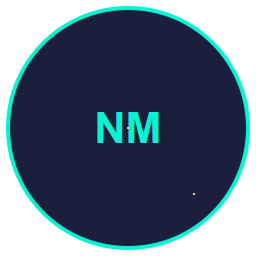

# NeoMeme Markets — Autonomous Hardened Meme‑Coin Trading Bot

<p align="center">
  
</p>

<p align="center">
  <a href="https://github.com/Snapwave333/membot/releases/latest"></a>
  <a href="https://github.com/Snapwave333/membot/releases/latest"></a>
  <a href="https://github.com/Snapwave333/membot"></a>
  <a href="LICENSE"></a>
  <a href="https://github.com/Snapwave333/membot/actions"></a>
</p>

<p align="center">
  <a href="#download">Download</a> •
  <a href="#features">Features</a> •
  <a href="#screenshots">Screenshots</a> •
  <a href="#getting-started">Getting Started</a> •
  <a href="#desktop-app-windows">Desktop App</a> •
  <a href="#security">Security</a> •
  <a href="#architecture">Architecture</a> •
  <a href="#roadmap">Roadmap</a> •
  <a href="#faq">FAQ</a> •
  <a href="#contributing">Contributing</a>
</p>

NeoMeme Markets is a secure, autonomous trading bot for meme‑coins with fail‑closed security defaults, comprehensive safety controls, Kraken compliance layer, Solana integration, and Telegram signal processing. It features a layered brain that combines rules-based logic with machine learning, and a minimal desktop wrapper for Windows built with Electron Forge.

<p align="center">
  
</p>

## Table of Contents

- [Download](#download)
- [Releases](#releases)
- [Features](#features)
- [Screenshots](#screenshots)
- [Getting Started](#getting-started)
- [Desktop App (Windows via Electron Forge)](#desktop-app-windows-via-electron-forge)
- [Live Mode](#live-mode)
- [Security](#security)
- [Recent Changes](#recent-changes)
- [Architecture](#architecture)
- [Tech Stack](#tech-stack)
- [Environment Variables](#environment-variables)
- [Development](#development)
- [Security Considerations](#security-considerations)
- [Roadmap](#roadmap)
- [GitHub History 📈](#github-history-)
- [FAQ](#faq)
- [Troubleshooting](#troubleshooting)
- [Contributing](#contributing)
- [Acknowledgements](#acknowledgements)
- [License](#license)

## Download

- Latest Windows installer (recommended):
  - Direct link: https://github.com/Snapwave333/membot/releases/latest/download/NeoMemeMarkets-Setup.exe
  - Specific version: https://github.com/Snapwave333/membot/releases/download/v1.0.1/NeoMemeMarkets-Setup.exe
- Portable ZIP: `electron/out/make/zip/win32/x64/NeoMeme Markets-win32-x64-1.0.1.zip` (for advanced users)

Note: The Windows wrapper expects a Python virtual environment to be present with dependencies installed. See Getting Started.

## Releases

- Latest release: https://github.com/Snapwave333/membot/releases/latest
- v1.0.0 initial release: https://github.com/Snapwave333/membot/releases/tag/v1.0.0
- v1.0.1 tag: https://github.com/Snapwave333/membot/releases/tag/v1.0.1

Release badges are shown at the top of this README. Full changelog is maintained via commit history and release notes.

## Features

### 🔒 Security & Safety
- **Fail-Closed Security**: Refuses to trade when in doubt
- **Encrypted Hot Wallets**: Secure key management with Argon2 KDF and AES-GCM for EVM and Solana
- **Paper Mode**: Fully functional isolated testing environment
- **Safety Controls**: Kill-switch, profit sweep, position limits

### 🏛️ Kraken Compliance Layer
- **Token Safety Assessment**: Bytecode analysis, owner privilege detection
- **Liquidity Analysis**: LP token lock verification, router compatibility
- **Holder Distribution**: Top holder concentration analysis
- **Social Verification**: Multi-source corroboration
- **External Tool Integration**: DexScreener, Birdeye validation
- **Hard Veto System**: Automatic blocking of unsafe tokens

### ⚡ Solana Integration
- **SPL Token Support**: Native Solana token trading
- **DEX Integration**: Serum, Orca, Raydium, Jupiter aggregator
- **Compute Budget Optimization**: Transaction priority and fee management
- **Multi-Chain Support**: Simultaneous EVM and Solana operations

### 📡 Signal Processing (Telegram)
- **Real-Time Signal Ingestion**: Telegram Bot API integration
- **Astroturf Detection**: Bot account identification, fake engagement detection
- **Multi-Source Corroboration**: Signal validation across platforms
- **Rate Limiting**: Throttling and spam protection

### 🧠 Intelligent Trading
- **Layered Brain**: Rules engine + ML components for decision making
- **Kraken Weighting**: ML confidence adjustment based on compliance
- **Real-Time Analysis**: Market data, sentiment, risk assessment
- **Adaptive Strategies**: Dynamic position sizing and risk management

### 🖥️ User Interface & Infrastructure
- **Native GUI**: Secure PySide6 interface with multi-chain support
- **Comprehensive Logging**: Full audit trail with database persistence
- **Unit Tests**: Complete test coverage with pytest
- **PAPER_MODE Demo**: Comprehensive demonstration script

## Screenshots

<p align="center">
  
  
  
</p>

<details>
  <summary>Theme & Sprites</summary>
  <p>NeoMeme Markets includes a sprite system and animations for visual feedback in the GUI, aligned to the "Neo" theme.</p>
</details>

## Getting Started

### Quick Start (Paper Mode)

1. Clone and setup:
```bash
git clone <repo>
cd membot
python -m venv venv
source venv/bin/activate  # On Windows: venv\Scripts\activate
pip install -r requirements.txt
```

2. Configure environment:
```bash
cp .env.example .env
# Edit .env with your configuration (no real keys needed for paper mode)
```

3. Run PAPER_MODE demonstration:
```bash
# Windows
runpaperdemo.bat

# Linux/Mac
./runpaperdemo.sh

# Or run directly
python run_paper_demo.py
```

4. Run in paper mode:
```bash
python main.py --paper-mode
```

### Desktop App (Windows via Electron Forge)

Build and run a Windows desktop wrapper that launches the Python GUI.

- Install Node.js deps:
```bash
cd electron
npm install
```
- Dev run (spawns Python GUI using venv):
```bash
npm start
```
- Build Windows installer (Squirrel):
```bash
npm run make
# Output: electron/out/make/squirrel.windows/x64/NeoMemeMarkets-Setup.exe
```
Notes:
- The launcher executes `../venv/Scripts/python.exe src/gui/main_window.py` with `PYTHONPATH` set to the repo root.
- Ensure the Python venv and dependencies are installed before running the installer; alternatively, bundle with PyInstaller and ship the EXE via Forge `extraResources`.

### Live Mode

To enable live mode trading, review and follow deployment safeguards in `DEPLOYMENT.md` and enable feature flags in your `.env`.

```bash
python main.py --live-mode
```
Ensure you understand all safety controls before enabling live trading.

## Security

- All secrets loaded from `.env` file
- Encrypted private key storage with secure passphrase
- Fail-closed defaults (refuses to trade when uncertain)
- Paper mode isolation from real trading
- Comprehensive audit logging
- Kill-switch and emergency controls

## Recent Changes
- Solana wallet-only flow (remove PayPal)
- Scam Detection tab with heuristics
- Axiom.trade Discovery integration
- Digital Wallet tab: init, reinvest, withdraw, trade history
- Market Mode toggle (Simulation/Live)
- NeoMeme Markets theme, sprites, animations
- Accordion-style collapsible sections and scroll areas
- Electron Forge Windows installer

## Architecture

High-level layout:

```
NeoMeme-Markets (membot)/
├── src/
│   ├── config.py              # Configuration parameters
│   ├── security/
│   │   └── wallet_manager.py  # Encrypted wallet management
│   ├── security/contract_checker.py  # Token safety assessment
│   ├── trading/
│   │   ├── exchange.py        # Exchange interface
│   │   ├── strategy.py        # Trading strategies
│   │   └── risk_manager.py    # Risk management
│   ├── brain/
│   │   ├── rules_engine.py    # Rules-based logic
│   │   └── ml_engine.py       # Machine learning components
│   ├── gui/
│   │   └── main_window.py     # PySide6 GUI
│   └── utils/
│       ├── logger.py          # Logging utilities
│       └── database.py        # Database operations
├── tests/                     # Unit tests
├── .env.example              # Environment template
├── requirements.txt          # Python dependencies
├── pyproject.toml           # Project configuration
├── Dockerfile               # Container configuration
└── main.py                  # Application entry point
```

See also:
- Kraken Compliance: `KRAKENCOMPLIANCE.md`
- Solana Integration: `SOLANAINTEGRATION.md`
- Deployment Checklist: `DEPLOYMENT.md`
- Project Overview: `PROJECT_SUMMARY.md`

## Tech Stack

<p>
  
  
  
  
  
  
  
  
  
  
</p>

Tech highlights: Python 3.11/3.12, PySide6 (Qt), Electron Forge (Windows wrapper), WebSockets, Solana/EVM tooling, pytest.

## Environment Variables

See `.env.example` for required configuration variables:

### RPC Endpoints
- `ETHRPCPRIMARY`, `ETHRPCFALLBACK`: Ethereum RPC endpoints
- `SOLANARPCPRIMARY`, `SOLANARPCFALLBACK`: Solana RPC endpoints
- `WSMEMPOOLPRIMARY`: WebSocket mempool connection

### Security & Trading
- `COLDSTORAGEADDRESS`: Cold storage wallet address
- `NOTIFIERTOKEN`: Notification service token
- `TELEGRAMBOTTOKEN`: Telegram bot token for signal ingestion

### External Services
- `MODELSTOREURL`: ML model storage URL
- `INDEXERURL`: Blockchain indexer URL
- `BACKUPSTORAGEURL`: Backup storage URL
- `GUIAPISOCKET`: GUI API socket path

### Feature Flags
- `SOLANAMODE`: Enable Solana trading (true/false)
- `TELEGRAMMODE`: Enable Telegram signal processing (true/false)
- `PAPERMODE`: Run in paper mode (true/false)

## Development

Run tests:
```bash
pytest tests/
```

Build Docker image:
```bash
docker build -t meme-bot .
```

## GitHub History 📈

<p>
  
  
</p>

Snake contribution graph:

<p>
  
</p>

Note: If the snake image is 404 initially, run the "Generate Datas" workflow once from the Actions tab.

## Security Considerations

- Never commit `.env` files or private keys
- Use paper mode for testing
- Review all security decisions in code comments
- Follow deployment checklist in `DEPLOYMENT.md`
- Enable kill-switch before live trading

## Roadmap

- v1.1.x
  - Enhanced Solana DEX routing and fee optimization
  - Expanded heuristics for scam detection
  - Modular strategy packs
- v1.2.x
  - Cross-chain bridges and EVM execution safety improvements
  - GUI workflow enhancements and accessibility

## FAQ

- Is it safe to run live?  
  The bot is built with fail‑closed defaults, but live trading is inherently risky. Review `DEPLOYMENT.md`, use small allocations, and enable the kill‑switch.
- Does it support multiple chains?  
  Yes. Solana is prioritized; EVM support exists for wallet management and compliance checks.
- Why Solana‑only wallet flow now?  
  We simplified the initial release to Solana to reduce complexity and improve reliability, replacing the earlier PayPal concept.
- How do I add a new strategy?  
  Implement it in `src/trading/strategy.py` and register it with the rules/ML engine. Add tests in `tests/`.

## Troubleshooting

- Windows Electron launcher shows "spawn ... python.exe ENOENT":
  - Ensure a virtual environment exists at `resources/venv` for the installed app or `../venv` during development.
  - Create venv and install deps:
    ```powershell
    # From repo root
    py -3.12 -m venv venv  # or py -3.11
    venv\Scripts\pip install --upgrade pip
    venv\Scripts\pip install -r requirements.txt
    ```
  - For installed app v1.0.0, create `AppData\Local\NeoMemeMarkets\app-1.0.0\resources\venv` and install deps similarly.

- Python 3.13 CFFI/package issues:
  - Use Python 3.12 or 3.11. The launcher prefers these versions.

- Dependency resolution conflicts (solana/solders/websockets):
  - Recommended pins: `solana==0.32.0`, `solders==0.20.0`, `websockets==11.0`.

- Electron Forge build errors under OneDrive (EBUSY):
  - Build outside OneDrive, e.g., `C:\membot-build\electron`.

## Contributing

Contributions, issues, and feature requests are welcome!

- Fork the repo and create a feature branch
- Write tests for new functionality
- Follow code style and security guidelines
- Open a PR with a clear description and checklist

## Acknowledgements

- Capsule Render banner
- Electron Forge for the desktop wrapper
- PySide6 for the GUI
- The broader open‑source community and tooling around Solana and EVM

## License

MIT License - see LICENSE file for details.
