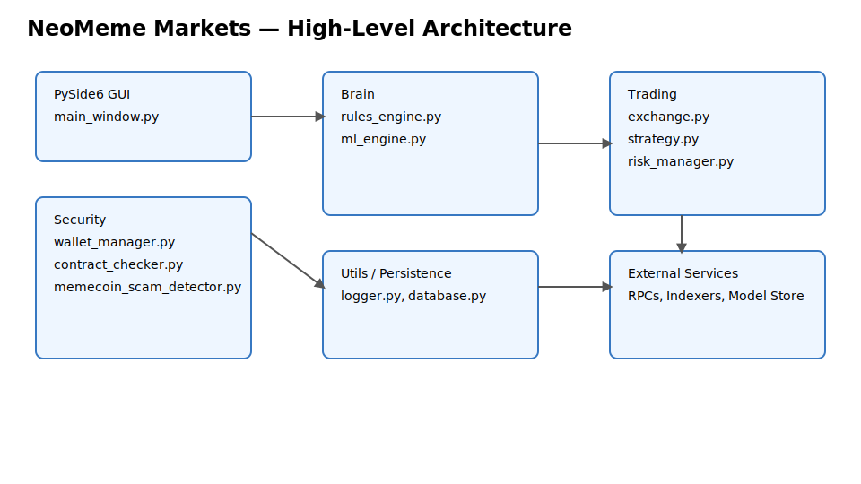

# Diagrams

This page collects visual diagrams of core flows and pipelines.

## System Architecture

## Wallet Encryption Flow (Mermaid)

flowchart TD
    A[Generate Keypair] --> B[Serialize]
    B --> C[Argon2 KDF]
    C --> D[AES-GCM Encrypt]
    D --> E[Write .encrypted_key (0600)]
    E --> F{Unlock}
    F -->|Passphrase OK| G[Decrypt]
    G --> H[Deserialize Keypair]
    H --> I[Validate + Use]
    F -->|Fail| J[Abort — Fail-Closed]

## Compliance Pipeline (Mermaid)

flowchart LR
    T[Token] --> B[Bytecode Analysis]
    T --> O[Owner Privileges]
    T --> L[Liquidity Analysis]
    T --> H[Holder Distribution]
    C[Community Signals] --> S[Social Verification]
    B --> V[Hard Veto Check]
    O --> V
    L --> V
    H --> V
    S --> V
    V --> SC[Compliance Score]
    SC --> R[Risk Manager]

## SVG Versions

For static embedding or offline viewing, SVG versions are available:

- [Wallet Encryption Flow (SVG)](./assets/wallet_encryption_flow.svg)
- [Compliance Pipeline (SVG)](./assets/compliance_pipeline.svg)

Tip: Right-click and "Save As" to download the SVGs.
