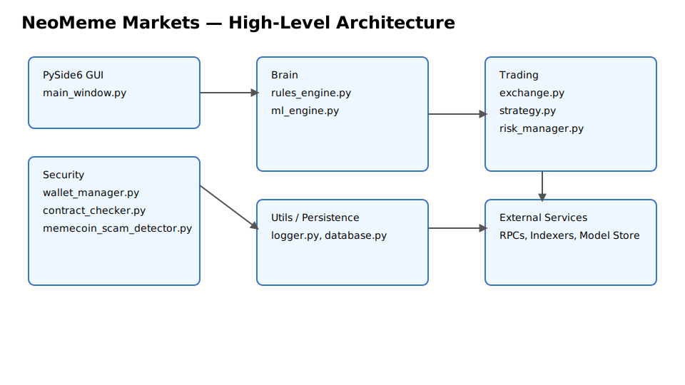

# NeoMeme Markets Documentation


Welcome to the NeoMeme Markets documentation site. This site contains the comprehensive User Manual, setup guidance, and reference materials.

- Read the full [User Manual](./user-manual.html)
- View the project on GitHub: https://github.com/Snapwave333/membot
- Quick start:
  ```bash
  git clone https://github.com/Snapwave333/membot.git
  cd membot
  python -m venv venv && source venv/bin/activate
  pip install -r requirements.txt
  cp env.example .env
  python main.py --paper-mode
  ```

## Contents
- User Manual (this site): [./user-manual.html](./user-manual.html)
- CHANGELOG: https://github.com/Snapwave333/membot/blob/main/CHANGELOG.md
- README: https://github.com/Snapwave333/membot/blob/main/README.md

## Architecture Diagram


