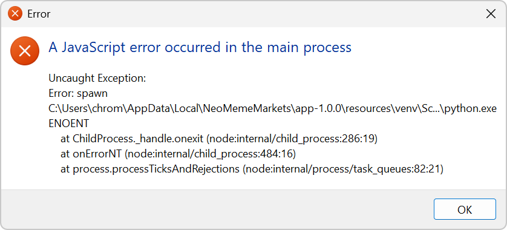

# NeoMeme Markets Documentation



Welcome to the NeoMeme Markets documentation site. This site contains the comprehensive User Manual, setup guidance, and reference materials.

- Read the full [User Manual](./user-manual.html)
- Idiot's Guide (Day One Profit Strategy): https://github.com/Snapwave333/membot/blob/main/IDIOTS_GUIDE.md
- View the project on GitHub: https://github.com/Snapwave333/membot
- Quick start:
  ```bash
  git clone https://github.com/Snapwave333/membot.git
  cd membot
  python -m venv venv && source venv/bin/activate
  pip install -r requirements.txt
  cp .env.example .env
  python main.py --paper-mode
  ```

## Sections
- [User Manual](./user-manual.html)
- [Troubleshooting Index](./troubleshooting.html)
- [Diagrams](./diagrams.html)
- [CHANGELOG](https://github.com/Snapwave333/membot/blob/main/CHANGELOG.md)
- [README](https://github.com/Snapwave333/membot/blob/main/README.md)
- [Idiot's Guide](https://github.com/Snapwave333/membot/blob/main/IDIOTS_GUIDE.md)

## Architecture Diagram

