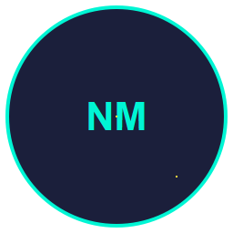

# NeoMeme Markets — Comprehensive User Manual and Tutorial



This manual synthesizes existing project documentation into a single, cohesive guide. It is derived solely from: README.md, PROJECT_SUMMARY.md, CHANGELOG.md, DEPLOYMENT.md, SOLANAINTEGRATION.md, and KRAKENCOMPLIANCE.md.

<details>
<summary><strong>Quick Navigation — Collapsible Table of Contents</strong></summary>

- [Chapter 1: Project Overview](#chapter-1-project-overview)
  - [1.1 Purpose and Vision](#11-purpose-and-vision)
  - [1.2 Key Features](#12-key-features)
    - [1.2.1 Security & Safety](#121-security--safety)
    - [1.2.2 Intelligent Trading](#122-intelligent-trading)
    - [1.2.3 User Interface](#123-user-interface)
    - [1.2.4 Data & Persistence](#124-data--persistence)
  - [1.3 Recent Changes](#13-recent-changes)

- [Chapter 2: Initial Setup and Installation](#chapter-2-initial-setup-and-installation)
  - [2.1 Prerequisites](#21-prerequisites)
  - [2.2 Create a Virtual Environment](#22-create-a-virtual-environment)
  - [2.3 Install Dependencies](#23-install-dependencies)
  - [2.4 Configure Environment Variables](#24-configure-environment-variables)
  - [2.5 Run the Paper Mode Demo](#25-run-the-paper-mode-demo)
  - [2.6 Windows Desktop Wrapper (Electron Forge)](#26-windows-desktop-wrapper-electron-forge)
  - [2.7 Troubleshooting](#27-troubleshooting)
    - [2.7.1 Python Version Guidance](#271-python-version-guidance)
    - [2.7.2 Electron Launcher ENOENT](#272-electron-launcher-enoent)
    - [2.7.3 Dependency Pins](#273-dependency-pins)
    - [2.7.4 OneDrive Build Issues](#274-onedrive-build-issues)

- [Chapter 3: Deployment and Configuration](#chapter-3-deployment-and-configuration)
  - [3.1 Pre‑Deployment Checklist](#31-pre-deployment-checklist)
  - [3.2 Security Configuration](#32-security-configuration)
  - [3.3 Network Configuration](#33-network-configuration)
  - [3.4 Database Setup](#34-database-setup)
  - [3.5 Monitoring & Alerting](#35-monitoring--alerting)
  - [3.6 Deployment Steps](#36-deployment-steps)
  - [3.7 Docker Deployment](#37-docker-deployment)
  - [3.8 Emergency Procedures](#38-emergency-procedures)
  - [3.9 Risk Management](#39-risk-management)
  - [3.10 Security Best Practices](#310-security-best-practices)
  - [3.11 Compliance and Legal](#311-compliance-and-legal)

- [Chapter 4: Core Functionality Walkthrough](#chapter-4-core-functionality-walkthrough)
  - [4.1 Wallet Management (Solana)](#41-wallet-management-solana)
    - [4.1.1 Encrypted Keypair Generation and Storage](#411-encrypted-keypair-generation-and-storage)
    - [4.1.2 Decryption and Validation](#412-decryption-and-validation)
    - [4.1.3 Deposit and Withdraw](#413-deposit-and-withdraw)
  - [4.2 Market Modes](#42-market-modes)
    - [4.2.1 Simulation (Paper Mode)](#421-simulation-paper-mode)
    - [4.2.2 Live Mode](#422-live-mode)
  - [4.3 Kraken Compliance Layer](#43-kraken-compliance-layer)
    - [4.3.1 Principles](#431-principles)
    - [4.3.2 EVM Contract Checks](#432-evm-contract-checks)
    - [4.3.3 Solana Contract Checks](#433-solana-contract-checks)
    - [4.3.4 Social Verification](#434-social-verification)
    - [4.3.5 Compliance Scoring and Hard Veto](#435-compliance-scoring-and-hard-veto)

- [Chapter 5: Advanced Topics and Performance](#chapter-5-advanced-topics-and-performance)
  - [5.1 Security Features](#51-security-features)
    - [5.1.1 Fail‑Closed Defaults](#511-fail-closed-defaults)
    - [5.1.2 Audit Trails](#512-audit-trails)
    - [5.1.3 Kill‑Switch](#513-kill-switch)
  - [5.2 Solana Optimizations](#52-solana-optimizations)
    - [5.2.1 Compute Budget](#521-compute-budget)
    - [5.2.2 Priority Fees](#522-priority-fees)
    - [5.2.3 Blockhash and Transaction Handling](#523-blockhash-and-transaction-handling)
  - [5.3 Monitoring and Performance Metrics](#53-monitoring-and-performance-metrics)

- [Chapter 6: Architecture Overview](#chapter-6-architecture-overview)
  - [6.1 Project Structure](#61-project-structure)
  - [6.2 Tech Stack](#62-tech-stack)
  - [6.3 Environment Variables](#63-environment-variables)

- [Chapter 7: Testing](#chapter-7-testing)
  - [7.1 Unit Tests](#71-unit-tests)
  - [7.2 Integration Tests](#72-integration-tests)
  - [7.3 Paper Mode Testing](#73-paper-mode-testing)

- [Chapter 8: Contributing and Roadmap](#chapter-8-contributing-and-roadmap)
  - [8.1 Contribution Guidelines](#81-contribution-guidelines)
  - [8.2 Roadmap](#82-roadmap)

- [Appendix A: Detailed Index](#appendix-a-detailed-index)

</details>

-----

## Chapter 1: Project Overview

### 1.1 Purpose and Vision
NeoMeme Markets is an autonomous meme‑coin trading bot designed with fail‑closed security defaults, comprehensive safety controls, and robust Solana/EVM integrations. It features a layered brain that combines rules‑based logic with machine learning, and provides a secure PySide6‑based GUI. A minimal Windows desktop wrapper is available via Electron Forge.

Source highlights: README.md, PROJECT_SUMMARY.md

### 1.2 Key Features

#### 1.2.1 Security & Safety
- Fail‑closed defaults: refuses to trade when uncertain.
- Encrypted hot wallets: Argon2 KDF + AES‑GCM encryption.
- Kill‑switch mechanism: emergency stop controls.
- Paper mode: fully isolated testing environment.
- Comprehensive logging: audit trails for security and trading events.
- Risk management: position limits, stop‑loss, profit targets.

#### 1.2.2 Intelligent Trading
- Layered brain system: rules engine + ML predictions.
- Real‑time analysis: market data, sentiment, risk assessment.
- Adaptive strategies: dynamic position sizing and risk management.
- Performance monitoring: comprehensive metrics and analytics.

#### 1.2.3 User Interface
- Native GUI: PySide6 interface with multi‑chain support.
- Real‑time monitoring: positions, P&L, status.
- Control panels: risk settings and emergency controls.
- Logging interface: real‑time log viewing.

#### 1.2.4 Data & Persistence
- Database integration: SQLAlchemy with SQLite/PostgreSQL.
- Structured logging with rotation.
- Performance metrics and audit trails.

### 1.3 Recent Changes
- Windows installer: launcher venv bootstrap prefers Python 3.12/3.11 over 3.13 to avoid CFFI incompatibilities.
- First‑run bootstrap pins updated (e.g., solana==0.32.0, websockets==11.0); solders==0.20.0 recommended.
- Build reliability: use a non‑OneDrive mirror to avoid EBUSY issues.
- README enhancements and CI: snake contribution graph workflow.

Source: CHANGELOG.md, README.md

-----

## Chapter 2: Initial Setup and Installation


### 2.1 Prerequisites
- Python 3.11+ installed (recommend 3.12 or 3.11).
- Git installed.
- For Windows desktop wrapper: Node.js and Electron Forge.

### 2.2 Create a Virtual Environment
```bash
git clone <repo>
cd membot
python -m venv venv
source venv/bin/activate  # On Windows: venv\Scripts\activate
```

### 2.3 Install Dependencies
```bash
pip install -r requirements.txt
```

### 2.4 Configure Environment Variables
```bash
cp env.example .env
# Edit .env with your configuration (no real keys needed for paper mode)
```

Key variables (see README.md and env.example):
- RPC: ETHRPCPRIMARY/ETHRPCFALLBACK, SOLANARPCPRIMARY/SOLANARPCFALLBACK, WSMEMPOOLPRIMARY.
- Security & Trading: COLDSTORAGEADDRESS, NOTIFIERTOKEN, TELEGRAMBOTTOKEN.
- External Services: MODELSTOREURL, INDEXERURL, BACKUPSTORAGEURL, GUIAPISOCKET.
- Feature Flags: SOLANAMODE, TELEGRAMMODE, PAPERMODE.

### 2.5 Run the Paper Mode Demo
```bash
# Windows
runpaperdemo.bat
# Linux/Mac
./runpaperdemo.sh
# Or run directly
python run_paper_demo.py
```

Start the bot in paper mode:
```bash
python main.py --paper-mode
```

### 2.6 Windows Desktop Wrapper (Electron Forge)
Build and run a Windows desktop wrapper that launches the Python GUI.

Install Node.js dependencies:
```bash
cd electron
npm install
```

Run in development (spawns Python GUI using venv):
```bash
npm start
```

Build Windows installer (Squirrel):
```bash
npm run make
# Output: electron/out/make/squirrel.windows/x64/NeoMemeMarkets-Setup.exe
```

Launcher behavior:
- Executes `../venv/Scripts/python.exe src/gui/main_window.py` with `PYTHONPATH` set to repo root.
- Ensure Python venv + dependencies are installed before building the installer.

### 2.7 Troubleshooting

#### 2.7.1 Python Version Guidance
- Prefer Python 3.12 or 3.11; avoid 3.13 due to CFFI/package issues.

#### 2.7.2 Electron Launcher ENOENT
If you see "spawn ... python.exe ENOENT":
- Create a virtual environment at `resources/venv` for the installed app or `../venv` for dev.
- Install dependencies:
```powershell
py -3.12 -m venv venv  # or py -3.11
venv\Scripts\pip install --upgrade pip
venv\Scripts\pip install -r requirements.txt
```
- For installed app v1.0.0, create `AppData\Local\NeoMemeMarkets\app-1.0.0\resources\venv` and install deps similarly.

#### 2.7.3 Dependency Pins
- Recommended pins: `solana==0.32.0`, `solders==0.20.0`, `websockets==11.0`.

#### 2.7.4 OneDrive Build Issues
- Forge builds may fail under OneDrive (EBUSY). Build outside OneDrive, e.g., `C:\membot-build\electron`.

Sources: README.md, CHANGELOG.md

-----

## Chapter 3: Deployment and Configuration

### 3.1 Pre‑Deployment Checklist
- Python 3.11+ installed; virtual environment created and activated; dependencies installed; `.env` configured; no secrets in VCS.

### 3.2 Security Configuration
- Strong passphrase (12+ chars) for wallet encryption.
- Encrypted key file with secure permissions (0o600).
- Kill‑switch file path configured and accessible.
- Cold storage address verified and tested.
- Notification tokens configured and tested.

### 3.3 Network Configuration
- Primary RPC endpoint tested; secondary endpoint configured for failover.
- WebSocket connections tested; rate limits configured.
- Firewall rules configured where applicable.

### 3.4 Database Setup
- Database running and accessible; schema created; connection string tested.
- Backup strategy implemented; log retention policies configured.

### 3.5 Monitoring & Alerting
- Logging configured and tested; security event logging enabled.
- Performance monitoring configured; alerts tested.
- Health check endpoints configured.

### 3.6 Deployment Steps
```bash
# Clone repository
git clone <repository-url>
cd meme-bot

# Create virtual environment
python -m venv venv
source venv/bin/activate  # On Windows: venv\Scripts\activate

# Install dependencies
pip install -r requirements.txt

# Copy environment template
cp env.example .env
```

Configuration validation:
```bash
# Edit environment
nano .env
# Validate configuration
python main.py --validate
```

Wallet setup:
```bash
python main.py --setup   # encrypted wallet (first run only)
python main.py --paper-mode
```

Testing:
```bash
pytest tests/
pytest tests/ -m integration
python main.py --paper-mode
```

Enable live trading (dangerous):
```bash
python main.py --live
```

### 3.7 Docker Deployment

Build image:
```bash
docker build -t meme-bot .
```

Run container (paper mode):
```bash
docker run -d --name meme-bot-paper \
  -v $(pwd)/.env:/app/.env \
  -v $(pwd)/.encrypted_key:/app/.encrypted_key \
  -v $(pwd)/data:/app/data \
  -v $(pwd)/logs:/app/logs \
  meme-bot
```

Run container (live mode – dangerous):
```bash
docker run -d --name meme-bot-live \
  -v $(pwd)/.env:/app/.env \
  -v $(pwd)/.encrypted_key:/app/.encrypted_key \
  -v $(pwd)/data:/app/data \
  -v $(pwd)/logs:/app/logs \
  meme-bot --live
```

### 3.8 Emergency Procedures
Kill switch activation:
```bash
touch /tmp/meme_bot_kill_switch
# Bot will stop trading within 10 seconds
```

Emergency stop:
```bash
pkill -f "python main.py"
# Or if running in Docker
docker stop meme-bot-live
```

Recovery:
```bash
tail -f logs/memebot.log
tail -f logs/security.log
tail -f logs/trading.log
```

### 3.9 Risk Management
- Position limits and daily loss limits configured; profit sweep threshold and withdrawal configured; cold storage enabled.

### 3.10 Security Best Practices
- Key management: strong passphrases, rotation, secure storage.
- Network security: HTTPS, rate limiting, monitoring.
- System security: updates, least privilege, permissions, intrusion detection.

### 3.11 Compliance and Legal
- Regulatory compliance: controls, audit trails, reporting.
- Tax implications: tracking trades, gains/losses, records.
- Risk disclosure: start small; never risk more than you can afford to lose.

Source: DEPLOYMENT.md

-----

## Chapter 4: Core Functionality Walkthrough

### 4.1 Wallet Management (Solana)


#### 4.1.1 Encrypted Keypair Generation and Storage
- Generate new Solana keypair using solana‑py.
- Serialize keypair to bytes.
- Encrypt with Argon2 KDF + AES‑GCM.
- Store encrypted blob with secure permissions.

#### 4.1.2 Decryption and Validation
- Decrypt blob using passphrase.
- Deserialize to Keypair object.
- Validate integrity and usability.

#### 4.1.3 Deposit and Withdraw
- UI supports connecting an existing wallet or generating a new one.
- Deposit and withdraw operations available from the GUI.

Source: SOLANAINTEGRATION.md, README.md

### 4.2 Market Modes

#### 4.2.1 Simulation (Paper Mode)
- Fully functional isolated testing flow.
- Run with `python main.py --paper-mode` or the demo scripts.

#### 4.2.2 Live Mode
- Enable with `python main.py --live` after completing deployment safeguards.
- Review all safety controls before live trading.

Source: README.md, DEPLOYMENT.md

### 4.3 Kraken Compliance Layer

#### 4.3.1 Principles
- Token safety assessment: bytecode analysis, owner privilege analysis, liquidity analysis, holder distribution, social verification.
- Risk mitigation: Hard Veto System, position sizing adjustments, ML weighting, audit trail.

#### 4.3.2 EVM Contract Checks
- Bytecode analysis for hidden mint functions, transfer blocking, owner privileges, router compatibility.
- Owner privilege detection: mint/burn authority, transfer restrictions, fee manipulation, pause functions.
- Liquidity analysis: LP token lock, router compatibility, liquidity depth, slippage protection.
- Holder distribution: top holder concentration, whale detection, distribution analysis, lock‑up periods.

#### 4.3.3 Solana Contract Checks
- Token program analysis: mint authority status, freeze authority presence, supply limitations, program compatibility.
- Authority checks: mint authority disabled/limited, freeze authority, supply limits, authority transfer detection.
- Liquidity pool analysis: legitimate pool creation, liquidity locks, pool authority, swap fees.

#### 4.3.4 Social Verification
- Multi‑source corroboration via Telegram, Twitter, website verification, and community engagement.
- Astroturf detection: fake/bot accounts, posting cadence, templated content, engagement authenticity.

#### 4.3.5 Compliance Scoring and Hard Veto
- Score composition: bytecode safety (40%), liquidity (25%), holder distribution (20%), social verification (15%).
- Thresholds: 90‑100 excellent; below 60 veto.
- Hard‑veto conditions include hidden mint functions, transfer blocking, excessive owner powers, no liquidity lock, top holder >70%, no social presence.

Source: KRAKENCOMPLIANCE.md

-----

## Chapter 5: Advanced Topics and Performance

### 5.1 Security Features

#### 5.1.1 Fail‑Closed Defaults
- Refuse to trade when uncertain; comprehensive input validation; graceful error handling.

#### 5.1.2 Audit Trails
- Structured audit logging for security and trading events.

#### 5.1.3 Kill‑Switch
- Emergency stop mechanism with file‑based kill switch.

Source: PROJECT_SUMMARY.md, DEPLOYMENT.md

### 5.2 Solana Optimizations

#### 5.2.1 Compute Budget
- Configure compute units and maximum units to fit transaction complexity.

#### 5.2.2 Priority Fees
- Set transaction priority fees to improve confirmation speed.

#### 5.2.3 Blockhash and Transaction Handling
- Use recent blockhash; implement retries and timeouts.

Source: SOLANAINTEGRATION.md

### 5.3 Monitoring and Performance Metrics
- RPC performance; transaction success rates; compute budget usage; DEX integration status; unusual activity alerts.

Source: SOLANAINTEGRATION.md

-----

## Chapter 6: Architecture Overview


### 6.1 Project Structure
High‑level layout:
```
NeoMeme-Markets (membot)/
├── src/
│   ├── config.py              # Configuration parameters
│   ├── security/
│   │   └── wallet_manager.py  # Encrypted wallet management
│   ├── security/contract_checker.py  # Token safety assessment
│   ├── trading/
│   │   ├── exchange.py        # Exchange interface
│   │   ├── strategy.py        # Trading strategies
│   │   └── risk_manager.py    # Risk management
│   ├── brain/
│   │   ├── rules_engine.py    # Rules-based logic
│   │   └── ml_engine.py       # Machine learning components
│   ├── gui/
│   │   └── main_window.py     # PySide6 GUI
│   └── utils/
│       ├── logger.py          # Logging utilities
│       └── database.py        # Database operations
├── tests/                     # Unit tests
├── .env.example              # Environment template
├── requirements.txt          # Python dependencies
├── pyproject.toml           # Project configuration
├── Dockerfile               # Container configuration
└── main.py                  # Application entry point
```

Source: README.md, PROJECT_SUMMARY.md

### 6.2 Tech Stack
- Python, Node.js, Electron, Qt/PySide6, JavaScript, Docker, Git/GitHub, Windows/Linux.
- Highlights: Python 3.11/3.12; Electron Forge Windows wrapper; pytest; Solana/EVM tooling.

Source: README.md

### 6.3 Environment Variables
Groups (see `.env.example` and README.md):
- RPC Endpoints: ETH/Solana primary/fallback; WSMEMPOOLPRIMARY.
- Security & Trading: COLDSTORAGEADDRESS; NOTIFIERTOKEN; TELEGRAMBOTTOKEN.
- External Services: MODELSTOREURL; INDEXERURL; BACKUPSTORAGEURL; GUIAPISOCKET.
- Feature Flags: SOLANAMODE; TELEGRAMMODE; PAPERMODE.

-----

## Chapter 7: Testing

### 7.1 Unit Tests
```bash
pytest tests/
```

### 7.2 Integration Tests
```bash
pytest tests/ -m integration
```

### 7.3 Paper Mode Testing
```bash
python main.py --paper-mode
```

Source: README.md, DEPLOYMENT.md, PROJECT_SUMMARY.md

-----

## Chapter 8: Contributing and Roadmap

### 8.1 Contribution Guidelines
- Fork the repo and create a feature branch.
- Write tests for new functionality.
- Follow code style and security guidelines.
- Open a PR with a clear description and checklist.

Source: README.md

### 8.2 Roadmap
- v1.1.x: Solana DEX routing and fee optimization; expanded scam heuristics; modular strategy packs.
- v1.2.x: Cross‑chain bridges/EVM safety; GUI workflow and accessibility enhancements.

Source: README.md

-----

## Appendix A: Detailed Index (Alphabetical)

- Axiom.trade Discovery – README.md (Recent Changes)
- AES‑GCM – PROJECT_SUMMARY.md (Encrypted hot wallets)
- Argon2 KDF – PROJECT_SUMMARY.md (Encrypted hot wallets); SOLANAINTEGRATION.md (wallet encryption)
- Audit Trails – PROJECT_SUMMARY.md; DEPLOYMENT.md
- Binance/EVM Router Compatibility – KRAKENCOMPLIANCE.md (Liquidity analysis)
- Blockhash (Recent) – SOLANAINTEGRATION.md (Transaction validity)
- Bytecode Analysis – KRAKENCOMPLIANCE.md (EVM checks)
- Cold Storage Address – DEPLOYMENT.md (Security configuration)
- Compliance Score – KRAKENCOMPLIANCE.md (Scoring system)
- Compute Budget – SOLANAINTEGRATION.md (Optimization)
- Database (SQLite/PostgreSQL) – PROJECT_SUMMARY.md; DEPLOYMENT.md
- DexScreener – KRAKENCOMPLIANCE.md (External tool integration)
- Docker Deployment – DEPLOYMENT.md
- Electron Forge – README.md (Windows wrapper)
- Encrypted Key File (0o600) – DEPLOYMENT.md
- Fail‑Closed Defaults – README.md; PROJECT_SUMMARY.md; DEPLOYMENT.md
- Feature Flags – README.md (Environment variables)
- Freeze Authority – SOLANAINTEGRATION.md (Token checks)
- GitHub Snake – README.md (CI workflow)
- Holder Distribution – KRAKENCOMPLIANCE.md
- Honeypot Behavior – SOLANAINTEGRATION.md; KRAKENCOMPLIANCE.md
- Kill‑Switch – DEPLOYMENT.md; PROJECT_SUMMARY.md
- Liquidity – KRAKENCOMPLIANCE.md
- Machine Learning – README.md (Layered brain)
- Mempool – README.md (WSMEMPOOLPRIMARY)
- Mint Authority – SOLANAINTEGRATION.md (Token checks)
- Paper Mode – README.md; DEPLOYMENT.md
- Priority Fees – SOLANAINTEGRATION.md (Optimization)
- PySide6 GUI – README.md
- Risk Management – README.md; DEPLOYMENT.md
- Router Compatibility – KRAKENCOMPLIANCE.md
- SQLAlchemy – PROJECT_SUMMARY.md; DEPLOYMENT.md
- Squirrel (Windows Installer) – README.md (Electron Forge)
- Telemetry/Monitoring – SOLANAINTEGRATION.md
- Wallet Encryption – SOLANAINTEGRATION.md; PROJECT_SUMMARY.md

